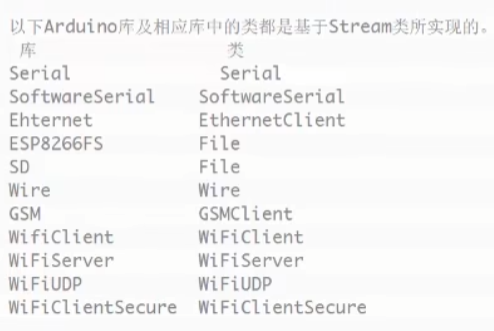

## Stream

数据序列-一个有序的数据



### SerialStream

```c++
void setup()
{
    Serial.begin(9600);
    Serial.println();
}

void loop()
{
    if(Serial.available())
    {
        String SerialData=Serial.readString();
        Serial.print(serialData);
    }
}
```


向串口发送数据，esp8266接收到数据后会通过串口返回数据

### Http响应和请求Stream

```c++
void wifiClientRequest()
{
    WiFiClient client;

    // 编辑请求信息
    /**
    GET / /HTTP/1.1
    Host: www.example.com
    Connection: close
    */
    String httpRequest=String("GET /")+" HTTP/1.1\r\n"+
    "Host: "+host+"\r\n"+
    "Connection: close\r\n"+
    "\r\n"; // 最后一个空行表示请求头结束

    Serial.print("Connecting to ");
    Serial.print(host);

    if(client.connect(host,httpPort))
    {
        Serial.println("Success!");

        client.print(httpRequest); // 向服务器发送请求信息
        Serial.println("Sending http request: ");
        Serial.println(httpRequest);

        // 接收服务器的响应信息（一问一答）
        Serial.println("Web server response: ");

        while(client.connected() || client.available())
        {
            if(client.available())
            {
                String line=client.readStringUnitl('\n');
                Serial.println(line);
            }
        }

        ...
    }
}
```

### FsStream

```c++
#include <FS.h>

String filename="/home/vezzzing.txt";

void setup()
{
    Serial.begin(9600);
    Serial.println("");

    // 启动SPIFFS
    if(SPIFFS.begin())
    {
        Serial.println("SPIFFS started");
    }
    else
    {
        Serial.println("SPIFFS failed to start");
    }

    File dataFile=SPIFFS.open(file_name,"w");
    dataFile.println("Hello IOT World");
    dataFile.close();
    Serial.println("Finished writing data to SPIFFS");

    // 使用find函数从dataFile中找到指定的信息
    Serial.print("Try to find IOT in ");
    Serial.println(filename);

    dataFile=SPIFFS.open(filename,"r");
    if(dataFile.find("IOT"))
    {
        Serial.print("Found IOT in file: ");
        Serial.print(filename);
    }
    
    // 使用readString读取执行完find函数后dataFile内容
    Serial.println(dataFile.readString());
    
    dataFile.close();
}
```

2024.4.29