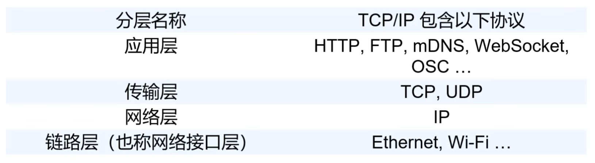

## 互联网基础

### TCP-IP协议

是一组协议的总称

#### 链路层

主要作用是实现设备之间的 **物理连接**

##### ESP8266链路层模式

1. 接入点模式

通过ESP8266建立wifi网络

2. 无线终端模式

3. 混合模式

既可以连入wifi，也可以发射wifi作为一个热点使用

#### 网络层

##### IP

为网络设备提供 **地址** 

##### 网关

上一级网络设备的地址（wifi路由器）

#### 传输层

主要有TCP UDP协议

##### TCP

比较稳

应用：

* 电子邮件

* 文件传输

传输速度相对比较慢

##### UDP

比较快

应用：

* 在线视频

* 网游

#### 应用层

##### HTTP协议

由请求和响应组成（一问一答）

还有请求体，这里没有展示

GET & POST

2024.4.22