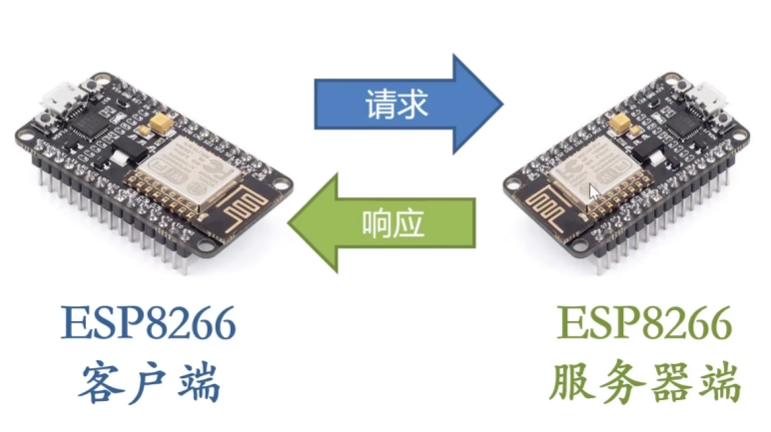

## 客户端基本操作-ESP8266HTTPClient

将esp8266作为客户端去请求其他服务器

### 架构

Esp8266-服务器


Esp8266客户端-Esp8266服务器



### 程序


返回首页信息

```c++
#include <ESP8266WiFi.h>
#include <ESP8266HTTPClient.h>

#define URL "http://www.example.com";

// 设置连接wifi信息
const char* ssid="vezzzing1";
const char* password="12345678";

void setup()
{
    Serial.begin(9600);

    // 重要！设置ESP8266为无线终端模式
    WiFi.mode(WIFI_STA);

    // 开始连接wifi
    WiFi.begin(ssid,password);

    // 等待wifi连接
    while(WiFi.status()!=WL_CONNECTED)
    {
        delay(1000);
        Serial.print(".");
    }
    Serial.println("");
    Serial.print("Wifi connected");

    httpClientRequest();
}

void loop()
{}

void httpClientRequest()
{
    HTTPClient httpClient;

    // 设置URL
    httpClient.begin(URL);
    Serial.print("URL: ");
    Serial.println(URL);

    // 通过GET发送请求
    int httpCode=httpClient.GET();
    Serial.print("Send GET request to URL: ");
    Serial.println(URL);

    // 如果服务器响应200则获取响应体信息并从串口输出
    // 如果响应的不是200则通过串口输出状态码
    if(httpCode==HTTP_CODE_OK)
    {
        String responsePayload=httpClient.getString();
        Serial.println("Server response payload: ");
        Serial.println(responsePayload);
    }
    else
    {
        Serial.println("Server response code: ");
        Serial.println(httpCode);
    }

    // 关闭连接
    httpClient.end();
}
```

#### HTTPClient库

http://www.taichi-maker.com/homepage/iot-development/iot-dev-reference/esp8266-c-plus-plus-reference/esp8266httpclient/

2024.4.28