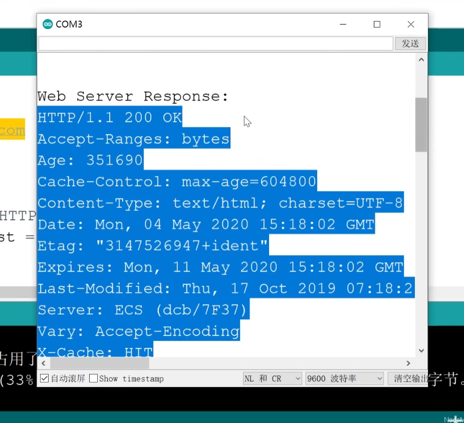

## 客户端基本操作-WiFiClient

注意只需要声明ESP8266WiFi库即可，WiFiClient库被包括在其中

```c++
#include <ESP8266WiFi.h>

const char* host="www.example.com"; // （常量指针）
const int httpPort=80;

// 设置wifi介入信息
// 设置连接wifi信息
const char* ssid="vezzzing1";
const char* password="12345678";

void setup()
{
    Serial.begin(9600);

    // 重要！设置ESP8266为无线终端模式
    WiFi.mode(WIFI_STA);

    // 开始连接wifi
    WiFi.begin(ssid,password);

    // 等待wifi连接
    while(WiFi.status()!=WL_CONNECTED)
    {
        delay(1000);
        Serial.print(".");
    }
    Serial.println("");
    Serial.print("Wifi connected");

    wifiClientRequest();
}

void loop()
{}

void wifiClientRequest()
{
    WiFiClient client;

    // 编辑请求信息
    /**
    GET / /HTTP/1.1
    Host: www.example.com
    Connection: close
    */
    String httpRequest=String("GET /")+" HTTP/1.1\r\n"+
    "Host: "+host+"\r\n"+
    "Connection: close\r\n"+
    "\r\n"; // 最后一个空行表示请求头结束

    Serial.print("Connecting to ");
    Serial.print(host);

    if(client.connect(host,httpPort))
    {
        Serial.println("Success!");

        client.print(httpRequest); // 向服务器发送请求信息
        Serial.println("Sending http request: ");
        Serial.println(httpRequest);

        // 接收服务器的响应信息（一问一答）
        Serial.println("Web server response: ");

        while(client.connected() || client.available())
        {
            if(client.available())
            {
                String line=client.readStringUnitl('\n');
                Serial.println(line);
            }
        }

        // 断开连接
        client.stop();
        Serial.println("Disconnected");
    }
}
```



2024.4.28