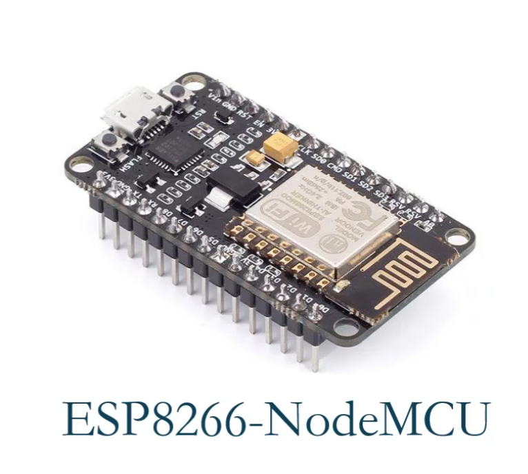
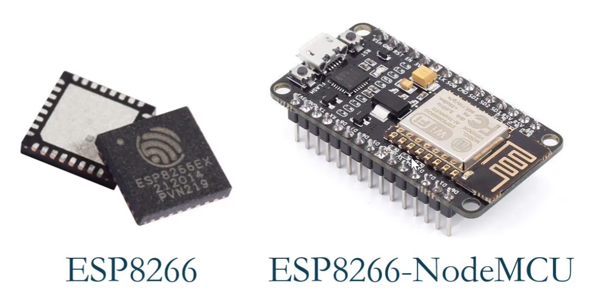
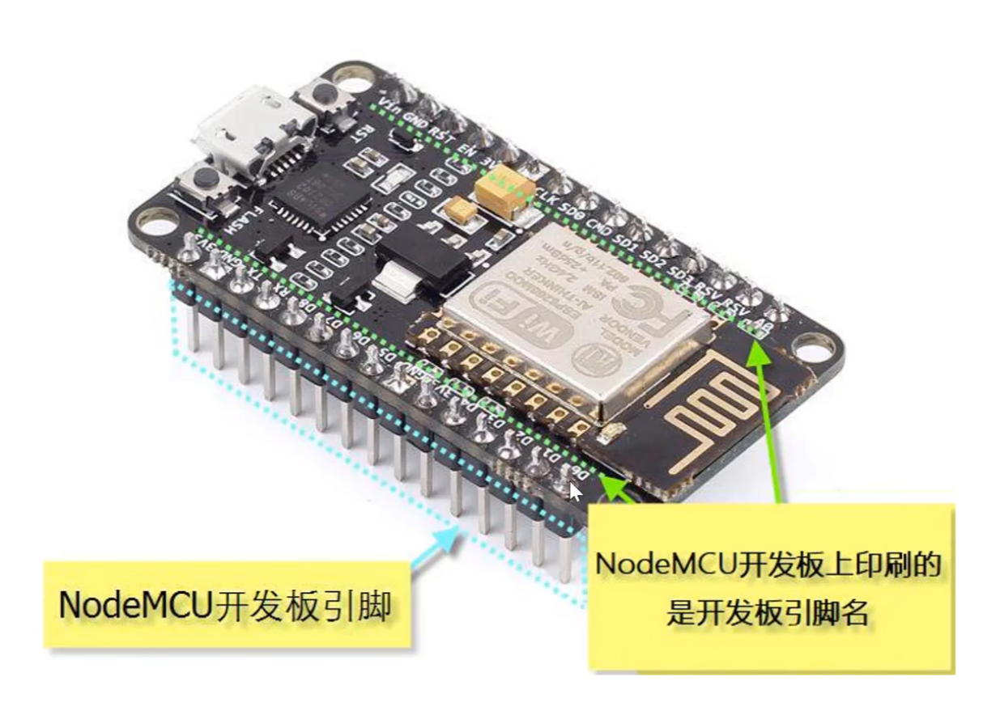
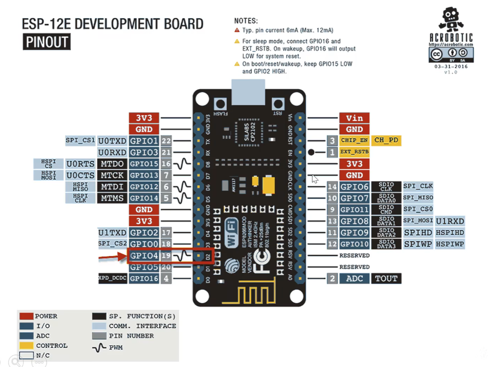

## 开发板详解



### 概念

ESP8266-NodeMCU=ESP8266+NodeMCU开发板



为什么有芯片了还要使用开发板？

* 将引脚引出，方便操作

* 便于烧写程序



### 引脚



* 浅蓝背景，黑色文字的引脚：通讯引脚（用于和arduino等通信），有两个硬件串口（U0TXD U0RXD，U1TXD U1RXD）

    * 注意不能直接连接arduino和esp8266（电压不同）

* 黑底白字引脚：操作esp8266内部存储单元的引脚

    * 14 10 9 13 11 12 引脚专门用来操作存储，开发过程中不用

#### 编号系统

GPIO编号指的是ESP8266芯片上的引脚编号

数字编号是开发板引脚编号

在程序中，这两套编号都是可以使用的

```c++
digitalWrite(D2,HIGH);
```

```c++
digitalWrite(4,HIGH);
```

这两句设置的是同一个引脚

#### ADC引脚

唯一的模拟引脚（其他都是数字引脚）

### 供电

* 通过 vin 端口

* 通过数据线

### 电压

高电平是3.3V!

输入模式的电压不能超过3.3V!

模拟引脚的电压范围 0-1V

### 按钮

* RESET：复位

* FLASH：刷固件用

2024.4.22