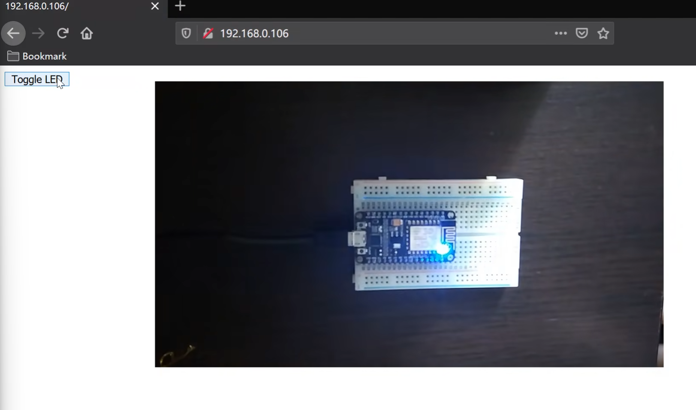

## 搭建web服务器

### 整体架构


### 建立基本网页服务器

```c++
esp8266_server.send();
```

```c++
#include <ESP8266WiFi.h>
#include <ESP8266WiFiMulti.h>
#include <ESP8266WebServer.h>

ESP8266WiFiMulti wifiMulti;

ESP8266WebServer esp8266_server(80); //用80端口

void setup()
{
    Serial.begin(9600);

    wifiMulti.addAP("vezzzing1","12345678");
    wifiMulti.addAP("vezzzing2","12345678");
    wifiMulti.addAP("vezzzing3","12345678");

    Serial.println("Connecting...");
    while(wifiMulti.run()!=WL_CONNECTED)
    {
        delay(1000);
        Serial.print('.');
    }

    Serial.println('\n');
    Serial.print("Connect to:");
    Serial.println(WiFi.SSID());
    Serial.print("IP Address:\t");
    Serial.println(WiFi.localIP());

    // ------启动网络服务-------
    esp8266_server.begin();
    esp8266_server.on("/",handleRoot); // 访问首页时提供调用函数
    esp8266_server.onNotFound(handleNotFound);

    Serial.print("server started");
}

void loop()
{
    esp8266_server.handleClient();
}

void handleRoot()
{
    esp8266_server.send(200,"text/plain","Hello from esp8266");
}

void handleNotFound()
{
    esp_server.send(404,"text/plain","404:Not Found");
}
```

### 通过页面控制LED



```c++
#include <ESP8266WiFi.h>
#include <ESP8266WiFiMulti.h>
#include <ESP8266WebServer.h>

ESP8266WiFiMulti wifiMulti;

ESP8266WebServer esp8266_server(80); //用80端口

void setup()
{
    Serial.begin(9600);

    // 设置引脚状态
    pinMode(LED_BUILTIN,OUTPUT);

    wifiMulti.addAP("vezzzing1","12345678");
    wifiMulti.addAP("vezzzing2","12345678");
    wifiMulti.addAP("vezzzing3","12345678");

    Serial.println("Connecting...");
    while(wifiMulti.run()!=WL_CONNECTED)
    {
        delay(1000);
        Serial.print('.');
    }

    Serial.println('\n');
    Serial.print("Connect to:");
    Serial.println(WiFi.SSID());
    Serial.print("IP Address:\t");
    Serial.println(WiFi.localIP());

    // ------启动网络服务-------
    esp8266_server.begin();
    esp8266_server.on("/",HTTP_GET,handleRoot);
    esp8266_server.on("/LED",HTTP_POST,handleLED);
    esp8266_server.onNotFound(handleNotFound);

    Serial.print("server started");
}

void loop()
{
    esp8266_server.handleClient();
}

void handleRoot()
{
    esp8266_server.send(200,"text/html","<form action=\"/LED\" method=\"POST\"><input type=\"submit\" value=\"Toggle LED\"></form>");
}

void handleLED()
{
    digitalWrite(LED_BUILTIN,!digitalRead(LED_BUILTIN)); // 对LED引脚的电平取反
    esp8266_server.sendHeader("Location","/"); // 跳转回页面根目录
    esp8266_server.send(303); // 发送表示跳转的状态码
}
```

### 将开发板的引脚状态显示在页面中

这里以 D3 引脚为例

这个引脚的引脚状态可以通过FLASH按钮来控制（开发板已经完成接线）

按下的时候是低电平，不按是高电平


```c++
#include <ESP8266WiFi.h>
#include <ESP8266WiFiMulti.h>
#include <ESP8366WebServer.h>

#define buttonPin D3

ESP8266WiFiMulti wifiMulti;

ESP8266WebServer esp8266_server(80);

bool pinState;

void setup()
{
    Serial.begin(9600);

    pinMode(buttonPin,INPUT_PULLUP);

    wifiMulti.addAP("vezzzing1","12345678");
    wifiMulti.addAP("vezzzing2","12345678");
    wifiMulti.addAP("vezzzing3","12345678");

    while(wifiMulti.run()!=WL_CONNECTED)
    {
        delay(1000);
        Serial.print('.');
    }

    Serial.println('\n');
    Serial.print("Connect to:");
    Serial.println(WiFi.SSID());
    Serial.print("IP Address:\t");
    Serial.println(WiFi.localIP());

    esp8266_server.begin();
    esp8266_server.on("/",handleRoot);
    esp8266_server.onNotFound(handleNotFound);

    Serial.println("server start successfully");
}

void loop()
{
    esp8266_server.handleClient();
    pinState=digitalRead(buttonPin);
}

void handleRoot()
{
    String displayPinState;

    if(pinState==HIGH)
    {
        displayPinState="Button State:HIGH";
    }
    else
    {
        displayPinState="ButtonState:LOW";
    }

    esp8266_server.send(200,"text/plain",displayPinState);
}

void handleNotFound(){...}
```

需要刷新后，显示的数据才会刷新

要实时刷新可以这样


2024.4.22