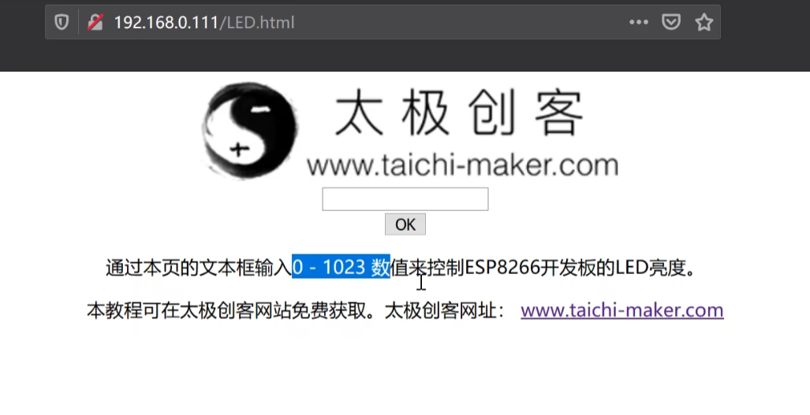
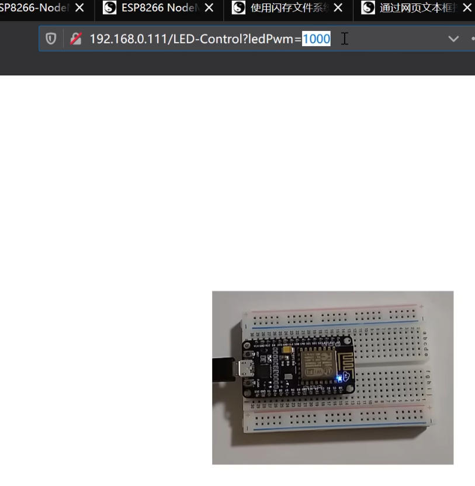

## 网络服务器

### 通过页面控制LED

```c++
digitalRead();
```

```c++
digitalWrite();
```

```c++
...
void setup()
{
    ...
    pinMode(LED_BUILTIN,OUTPUT);
    ...
    // 处理用户请求
    esp8266_server.on("/LED-Control",handleLEDControl);
    esp8266_server.onNotFound(handleUserRequest);
    ...
}

void loop()
{
    esp8266_server.handleClient();
}

void handleLEDControl()
{
    bool ledStatus=digitalRead(LED_BUILTIN);
    ledStaths==HIGH ? digitalWrite(LED_BUILTIN,LOW) : digitalWrite(LED_BUILTIN,HIGH);

    esp8266_server.sendHeader("Location","/LED.html");
    esp8266_server.send(303);
}

void handleUserRequest()...
bool handleFileRead(String resource)...
String getContentType(String filename)...
```

```html
<form action="LED-Control">
    <input type="submit" value="LED控制">
</form> 
```

### 控制PWM引脚

```c++
analogWrite();
```

```c++
esp8266_server.arg();
```



注意和arduino不同，esp8266的PWM范围是0-1023



可以通过PWM控制LED亮度

```c++
...
void setup()
{
    ...
    pinMode(LED_BUILTIN,OUTPUT);
    ...
    // 处理用户请求
    esp8266_server.on("/LED-Control",handleLEDControl);
    esp8266_server.onNotFound(handleUserRequest);
    ...
}

void loop()
{
    esp8266_server.handleClient();
}

void handleLEDControl()
{
    String ledPwm=esp8266_server.arg("ledPwm"); // get参数

    int ledPwmVal=ledPwm.toInt();

    analogWrite(LED_BUILTIN,ledPwmVal);

    // 建立网页基本信息和返回链接
    String httpBody="LED PWM:"+ledPwm+"<p><a href=\"LED.html\">..."
    esp8266_server.send(200,"text/html",httpBody);
}

void handleUserRequest()...
bool handleFileRead(String resource)...
String getContentType(String filename)...
```

2024.4.28