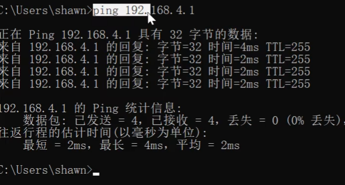

## 连接网络

### 接入点模式

将ESP板子作为热点使用

```c++
#include <ESP8266WiFi.h>

const char* ssid="vezzzing-net";
const char* password="12345678";

void setup()
{
    Serial.begin(9600);

    WiFi.softAP(ssid,password);

    Serial.print("Access Point:");
    Serial.println(ssid);
    Serial.print("IP Address:");
    Serial.println(WiFi.softAPIP());
}

void loop()
{}
```

注意每次上传源代码ESP8266板子不会自动复位，需要手动点一下按钮复位

#### 验证连接



### 无线终端模式

```c++
#include <ESP8266WiFi.h>

// 这里是板子要连接的wifi名称和密码
const char* ssid="vezzzing-net";
const char* password="12345678";

void setup()
{
    Serial.begin(9600);

    WiFi.begin(ssid,password);
    Serial.print("Connecting to:");
    Serial.print(ssid);
    Serial.println("...");

    int i=0;
    // 检查是否连接成功
    while(WiFi.status()!=WL_CONNECTED)
    {
        delay(1000);
        Serial.print(i++);
        Serial.print(' ');
    }

    // 连接成功
    Serial.println("");
    Serial.println("Connection Established!");
    Serial.print("IP Address:");
    Serial.println(WiFi.localIP());
}
```

#### 验证连接

同一个局域网中的电脑ping一下

#### 在多个wifi中自动连接

```c++
#include <ESP8266WiFi.h>
#include <ESP8266WiFiMulti.h>

ESP8266WiFiMulti wifiMulti;

void setup()
{
    Serial.begin(9600);

    wifiMulti.addAP("vezzzing1","123123123");
    wifiMulti.addAP("vezzzing2","123123123");
    wifiMulti.addAP("vezzzing3","123123123");

    Serial.println("Connecting...");
    int i=0;
    while(wifiMulti.run()!=WL_CONNECTED)
    {
        delay(1000);
        Serial.print('.');
    }

    Serial.println('\n');
    Serial.print("Connect to:");
    Serial.println(WiFi.SSID());
    Serial.print("IP Address:\t");
    Serial.println(WiFi.localIP());
}

void loop()
{}
```

2024.4.22