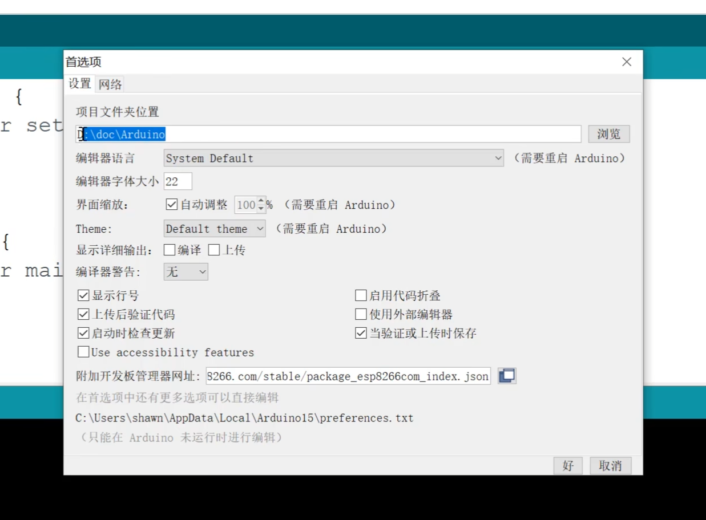
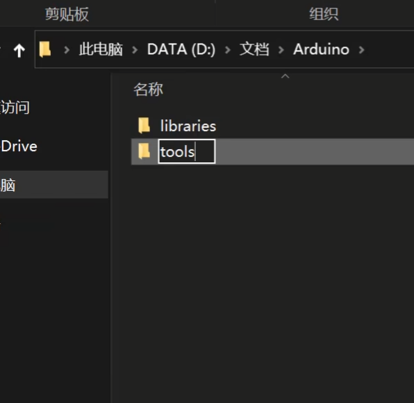
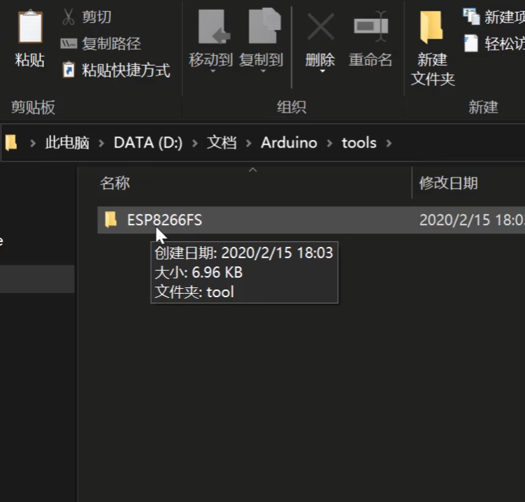
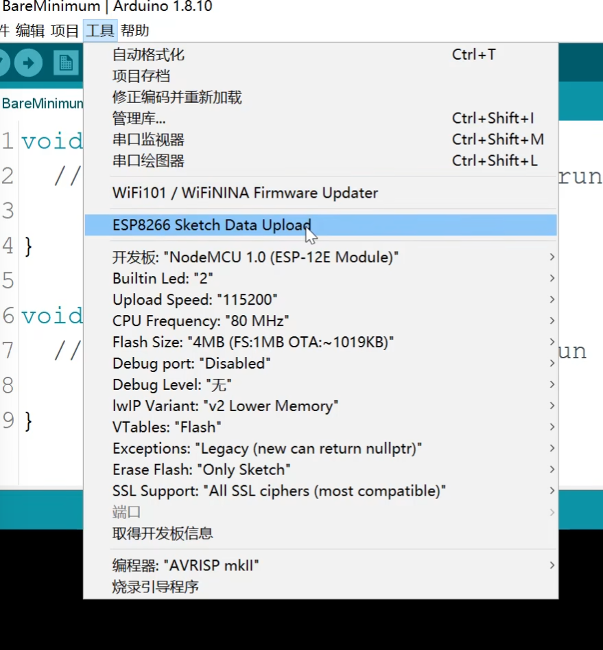
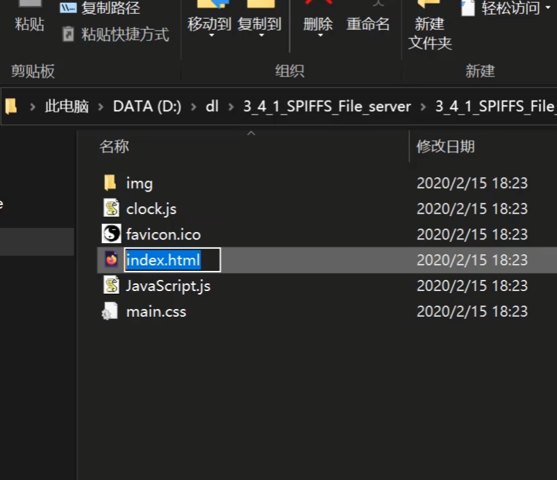

## 闪存文件应用

### 环境配置

可以从esp8266官方github下载

github.com/esp8266/arduino-esp8266fs-plugin/releases

找到arduino ide的项目文件夹



在这里新建一个目录



将下载下来的zip包解压到自己建立的tools文件夹



完了以后重启ide



### 网页服务器

以上传一个网站为例



```c++
#include <ESP8266WiFi.h>
#include <ESP8266WiFiMulti.h>
#include <ESP8266WebServer.h>
#include <FS.h>
 
ESP8266WiFiMulti wifiMulti;

ESP8266WebServer esp8266_server(80);

void setup()
{
    Serial.begin(9600);
    Serial.println("");

    wifiMulti.addAP("vezzzing1","12345678");
    wifiMulti.addAP("vezzzing2","12345678");

    Serial.println("Connecting...");

    int i=0;
    while(wifiMulti.run()!=WL_CONNECTED)
    {
        delay(1000);
        Serial.print(i++);
        Serial.print(' ');
    }

    // wifi连接成功
    Serial.println('\n');
    Serial.print("Connected to ");
    Serial.println(WiFi.SSID());
    Serial.print("IP address:\t");
    Serial.println(WiFi.localIP());

    // 启动闪存文件系统
    if(SPIFFS.begin())
    {
        Serial.println("SPIFFS Started");
    }
    else
    {
        Serial.println("SPIFFS failed to start");
    }

    // 处理用户请求
    // 我们没有写on函数
    // 因此所有的请求都会走onNotFound
    esp8266_server.onNotFound(handleUserRequest);

    esp8266_server.begin();
    Serial.println("Server started");
}

void loop()
{
    esp8266_server.handleClient();
}

void handleUserRequest()
{
    // 获取用户请求资源
    String reqResource=esp8266_server.uri();
    Serial.print("reqResource: ");
    Serial.println(reqResource);

    // 通过handleFileRead函数处理用户请求资源
    bool fileReadOK=handleFileRead(reqResource);

    // 如果SPIFFS无法找到用户访问的资源，回复404
    if(!fileReadOK)
    {
        esp8266_server.send(404,"text/plain","404 Not Found");
    }
}

bool handleFileRead(String resource)
{
    // 默认走首页
    if(resource.endWith("/"))
    {
        resource="/index.html";
    }

    String contentType=getContentType(resource); // 获取文件类型

    if(SPIFFS.exists(resource))
    {
        File file = SPIFFS.open(resource,"r"); // 尝试打开文件
        esp8266_server.streamFile(file,contentType); // 将文件返回给浏览器
        file.close();
        return true;
    }
    return false;
}

String getContentType(String filename)
{
    if(filename.endsWith(".htm")) return "text/html";
    else if(filename.endsWith(".html")) return "text/html";
    else if(filename.endsWith(".css")) return "text/css";
    else if(filename.endsWith(".js")) return "application/javascript";
    else if(filename.endsWith(".png")) return "image/png";
    else if(filename.endsWith(".gif")) return "image/gif";
    else if(filename.endsWith(".jpg")) return "image/jpeg";
    else if(filename.endsWith(".ico")) return "image/x-icon";
    else if(filename.endsWith(".xml")) return "text/xml";
    else if(filename.endsWith(".pdf")) return "application/x-pdf";
    else if(filename.endsWith(".zip")) return "application/x-zip";
    else if(filename.endsWith(".gz")) return "application/x-gzip";
    return "text/plain"; // 都不符合返回默认类型
}
```

2024.4.28