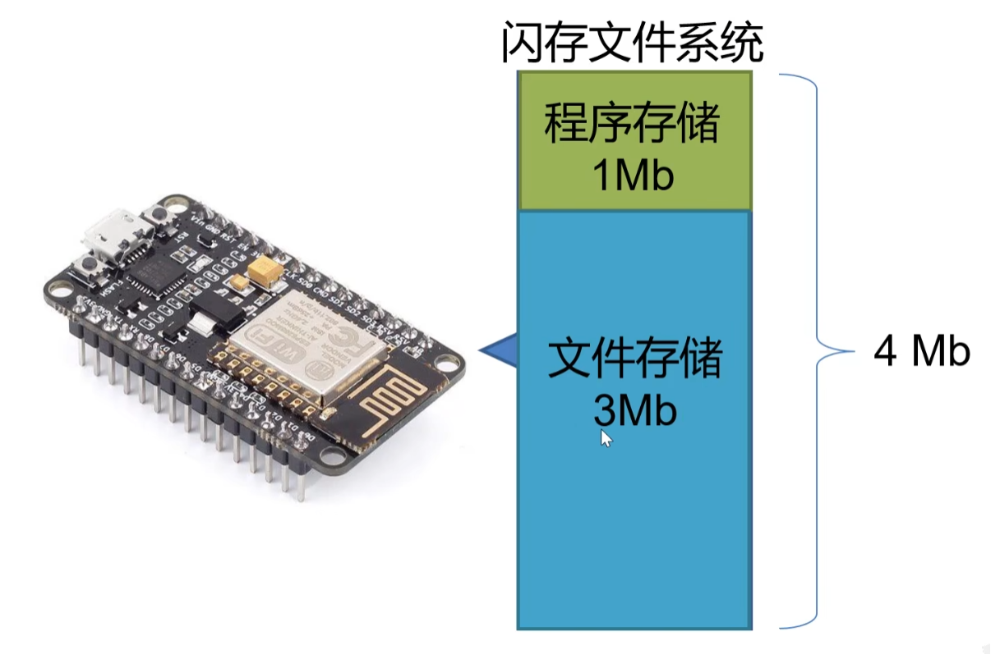
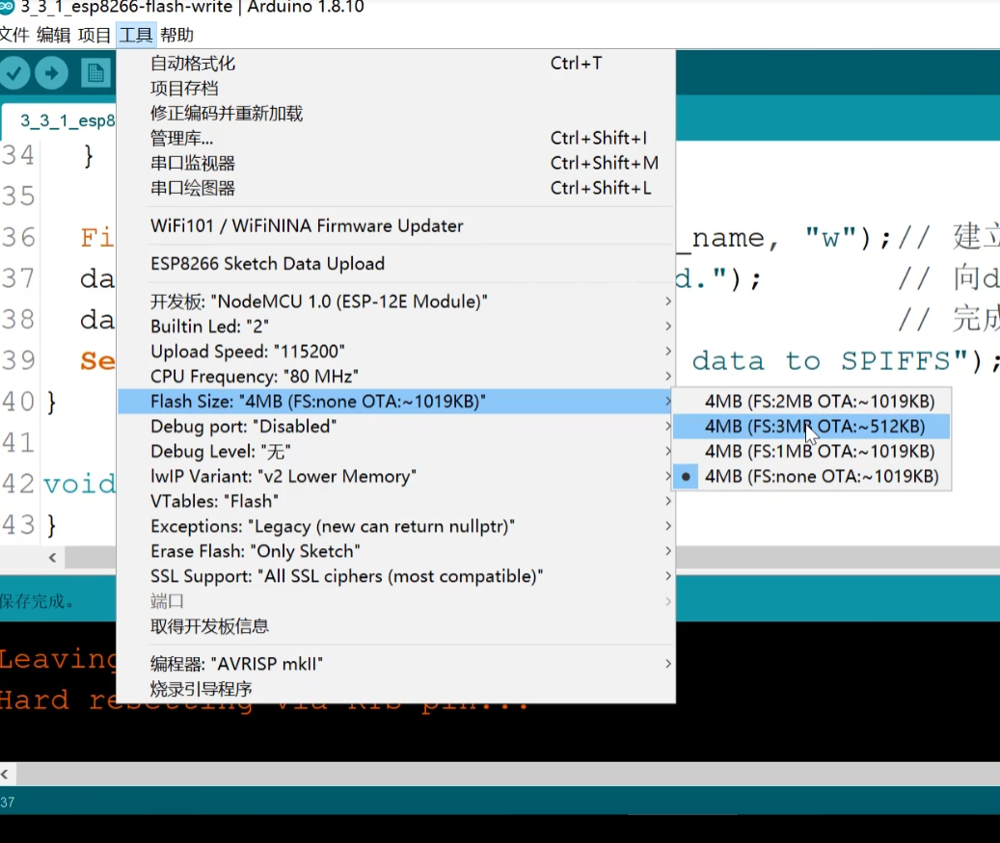

## 用程序控制闪存文件系统

esp8266的系统配置文件也存在闪存文件系统中



### 写入闪存

```c++
File dataFile=SPIFFS.open(file_name,"w");
```

```c++
#include <FS.h>

String file_name="/foo/bar.txt";

void setup()
{
    Serial.begin(9600);
    Serial.println("");

    Serial.println("SPIFFS format start");
    SPIFFS.format(); // 清除闪存系统中的内容
    Serial.println("SPIFFS format finish");

    // 启动闪存系统
    if(SPIFFS.begin())
    {
        Serial.println("SPIFFS started");
    }
    else
    {
        Serial.println("SPIFFS failed to start");
    }

    File dataFile=SPIFFS.open(file_name,"w");
    dataFile.println("Hello World ESP8266");
    dataFile.close();
    Serial.println("Finished writing data to SPIFFS");
}

void loop()
{}
```

需要对闪存系统进行设置



设置我们能够使用多少闪存

### 读取闪存文件

```c++
File dataFile=SPIFFS.open(file_name,"r");
```

```c++
#include <FS.h>

String file_name="/foo/bar.txt";

void setup()
{
    Serial.begin(9600);
    Serial.println("");

    // 启动闪存系统
    if(SPIFFS.begin())
    {
        Serial.println("SPIFFS started");
    }
    else
    {
        Serial.println("SPIFFS failed to start");
    }

    // 确认闪存中是否存在file_name文件
    if(SPIFFS.exists(file_name))
    {
        Serial.print(file_name);
        Serial.println(" FOUND.");
    }
    else
    {
        Serial.print(file_name);
        Serial.print("NOT FOUND.");
    }

    // 建立File对象从SPIFFS中读取文件
    File dataFile=SPIFFS.open(file_name,"r");

    // 读取文件内容，并通过串口监视器输出文件内容
    // .read函数只会输出一个字符
    // .size()返回文件有多大(以字节计)
    for(int i=0;i<dataFile.size();i++)
    {
        Serial.print((char)dataFile.read());
    }

    dataFile.close();
}

void loop()
{}
```

### 如何修改闪存中的文件

前面对一样，略

```c++
File dataFile=SPIFFS.open(file_name,"a"); // 向末尾加入
```

如果要覆盖就用 w

### 读取目录内容

```c++
...
String folder_name="/foo";

...
void setup()
{
    ...

    // 启动闪存文件系统
    ...

    // 显示目录中文件内容以及文件大小
    Dir dir=SPIFFS.openDir(folder_name);

    while(dir.next()) // 判断目录中是否有下一个文件
    {
        Serial.println(dir.fileName()); // 输出文件名
    }
}

void loop()
{}
```

### 从闪存中删除文件

```c++
...

void setup()
{
    ...

    // 启动闪存文件系统

    // 删除文件
    if(SPIFFS.remove(file_name))
    {
        Serial.print(file_name);
        Serial.println("remove success");
    }
    else // 文件不存在就会删除失败
    {
        Serial.print(file_name);
        Serial.println("remove fail");
    }
}

void loop()
{}
```

### 获取闪存文件系统信息

```c++
...

FSInfo fs_info;

void setup()
{
    ...
    // 启动SPIFFS
    ...
    // 闪存文件系统信息
    SPIFFS.info(fs_info);

    // 可用空间总和
    Serial.println(fs_info.totalBytes); // 单位是字节

    // 已用空间
    Serial.println(fs_info.usedBytes);

    // 最大文件命名字符限制
    Serial.println(fs_info.maxOpenFiles);

    // 储存块大小
    Serial.println(fs_info.blockSize);

    // 储存页大小
    Serial.println(fs_info.pageSize);
}

void loop()
{}
```

2024.2.23